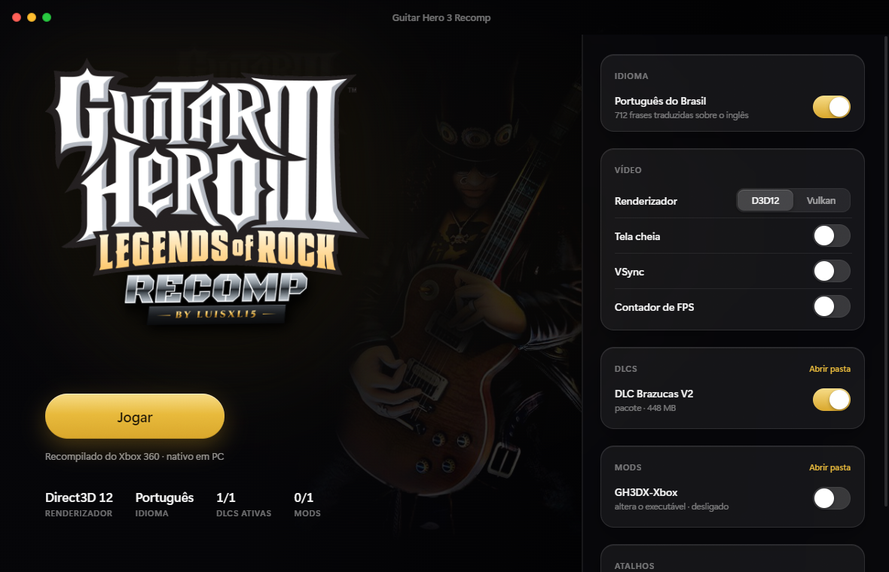
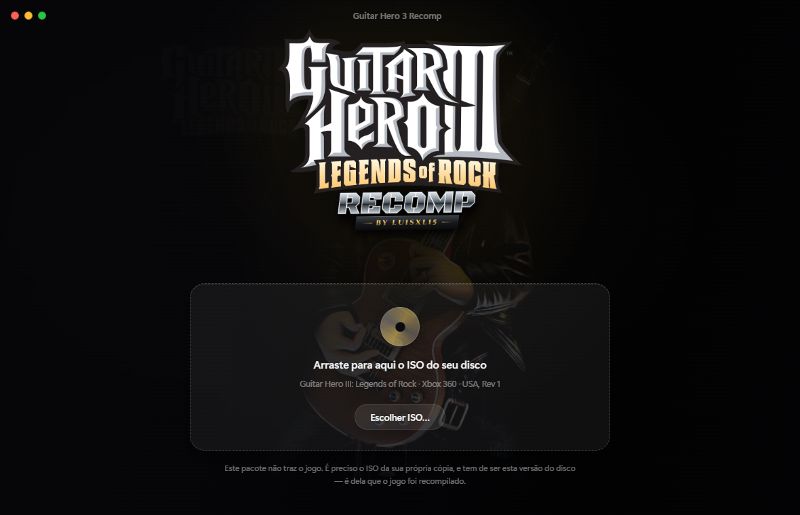
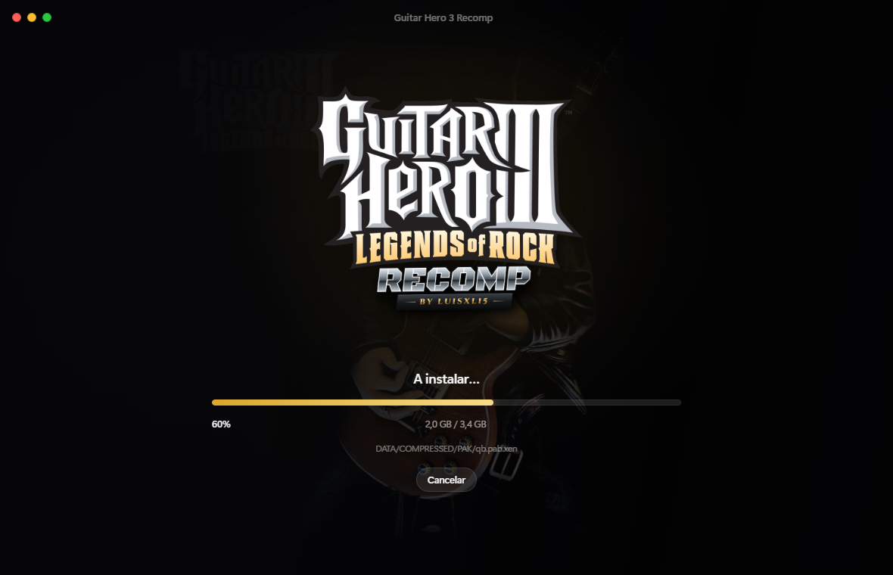

# Guitar Hero III: Legends of Rock — Recomp

Recompilação estática de **Guitar Hero III: Legends of Rock** (Xbox 360) para
PC e Android. O código PowerPC do jogo é traduzido para C++ nativo e compilado
para a máquina anfitriã — não é emulação de CPU.

Feito com [rexglue](https://github.com/hedge-dev/XenonRecomp) (fork ReXGlue) e
com um launcher próprio que instala o jogo a partir do seu disco.



---

## Isto não inclui o jogo

Este repositório é **só código**. Não traz, não distribui e não substitui
Guitar Hero III, que é da Activision e da Neversoft.

Para jogar você precisa do **ISO da sua própria cópia**, e tem de ser a versão
de que o projeto foi recompilado:

| | |
|---|---|
| Versão | Guitar Hero III: Legends of Rock (USA), Rev 1 |
| Disco | XGD2 — 660 ficheiros, 3,36 GB |
| `default.xex` | 11 055 104 bytes |
| SHA-256 | `1D67D98FBB0E35AC086D6354F3E49985698C83298226EAFDEC756E2A9E799A14` |

O launcher confere esse hash antes de instalar e recusa qualquer outra versão —
um recomp só corre o código do executável de que nasceu, e com dados de outra
versão o jogo não arranca.

---

## Como jogar

1. Abra o `launcher/RODAR.bat`.
2. Arraste o seu ISO para a janela, ou clique em **Escolher ISO**.
3. O launcher lê o disco, confere a versão e mostra o que encontrou.
4. **Instalar** — são cerca de 3,4 GB.
5. **Jogar**.

| Sem o jogo instalado | Durante a instalação |
|---|---|
|  |  |

O launcher é um app Electron e trata de tudo o resto:

| | |
|---|---|
| **Idioma** | liga e desliga a tradução para português do Brasil |
| **Vídeo** | Direct3D 12 ou Vulkan, tela cheia, VSync, contador de FPS |
| **DLCs** | liga e desliga cada pacote em `game/DLCs` |
| **Mods** | liga e desliga cada mod, e **escolhe o executável certo** (ver abaixo) |

### Mods que alteram o executável

Um mod como o **GH3 Deluxe** traz o próprio `default.xex`. Como um recomp só
corre o código de que nasceu, esse mod precisa de um build recompilado a partir
do XEX dele.

Cada build guarda um `source-xex.sha256` a dizer de que executável nasceu. O
launcher soma o `default.xex` dos mods ativos e lança o build correspondente;
sem mods de código, lança o base. Se houver dois mods de código ativos ao mesmo
tempo, recusa — dois XEX diferentes não se combinam num só jogo.

---

## Tradução PT-BR

`tools/traduzir_ptbr.py` escreve o texto português por cima do inglês, dentro
do arquivo de scripts do jogo. São 712 frases; o resto fica em inglês.

```bash
python tools/traduzir_ptbr.py              # instala
python tools/traduzir_ptbr.py --restaurar  # volta ao inglês
```

Só entram as frases que **cabem no espaço exato** da inglesa, enchidas com
espaços até ao tamanho original. Não é preciosismo: o jogo percorre as entradas
de texto em sequência, lendo cada uma até ao NUL, por isso encurtar uma frase
desalinha tudo o que vem a seguir e o jogo morre em dois segundos. Alongar
também não serve, mesmo corrigindo todos os offsets. Ver
[`docs/formato-qb.md`](docs/formato-qb.md).

É por isso que os itens do menu principal continuam em inglês: `CARREIRA` tem
oito letras e `CAREER` tem seis.

A tradução em si não está aqui — é trabalho de terceiros. O script espera uma
pasta `Tradutor_Guitar_Hero_III_Legends_Of_Rock` ao lado do projeto.

---

## Compilar

Precisa de: CMake, Clang/LLVM, Ninja e o SDK rexglue.

```bat
1-CODEGEN.bat      :: traduz o XEX para C++ (gera generated/, ~450 MB)
2-BUILD.bat        :: compila
```

O codegen precisa do `default.xex` extraído do seu ISO —
`tools/extract_xiso.py` faz isso. O C++ gerado **não** vai para o repositório:
é derivado do executável do jogo.

Para o build da variante Deluxe, `build-081-dx.bat`.

### Android

Corre o mesmo C++ gerado (`simde` vira NEON no ARM), por isso não há codegen
separado. Estado: jogável, com os vídeos Bink a saírem pretos. Ver
[`ANDROID.md`](ANDROID.md) e `build-android.bat`.

---

## Estrutura

```
src/            código do projeto (app, hooks, frame gen, renderer)
config/         manifests do codegen e listas de funções
tools/          ferramentas Python (extração de ISO, tradução, análise)
  extract_xiso.py     lê ISOs XDVDFS e extrai ficheiros
  traduzir_ptbr.py    instala a tradução PT-BR
  find_orphans.py     acha funções que o codegen não alcançou
  brand_boot_screen.py  marca o ecrã de arranque
launcher/       o launcher/instalador em Electron
  xiso.js             leitor XDVDFS em Node, com verificação de versão
  mods.js             mods e escolha de executável por hash do XEX
launcher-ps1/   o launcher antigo em PowerShell (referência histórica)
android/        projeto Android (fontes; os .so são compilados)
third_party/    lsfg-framegen (MIT, lsfg-vk)
docs/           notas técnicas sobre os formatos do jogo
```

---

## Estado

**Funciona:** o jogo corre no PC em Direct3D 12 e Vulkan, com FSR; carreira e
quickplay; DLC oficial em STFS; tradução PT-BR; Android jogável.

**Por resolver:**

- Os alvos dos trastes não aparecem na autoestrada.
- Vídeos Bink pretos no Android.
- Mods que substituem **parte** de uma pasta ensombram-na inteira: a camada de
  mods resolve o diretório para o mod e esconde os ficheiros do jogo que ele
  não traz. Um mod tem de fornecer todos os ficheiros das pastas que toca.

---

## Créditos

- **rexglue / ReXGlue SDK** — o recompilador e a camada de runtime
- **Xenia** — de onde vem boa parte do conhecimento sobre o hardware do 360
- **lsfg-vk** — geração de frames (MIT, em `third_party/`)
- **Neversoft / Activision** — o jogo

Licença do código deste repositório: [MIT](LICENSE).
